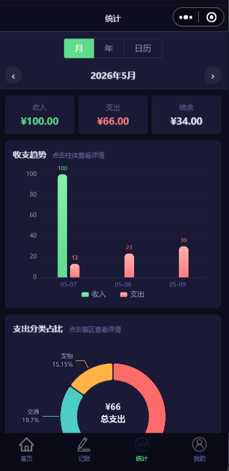
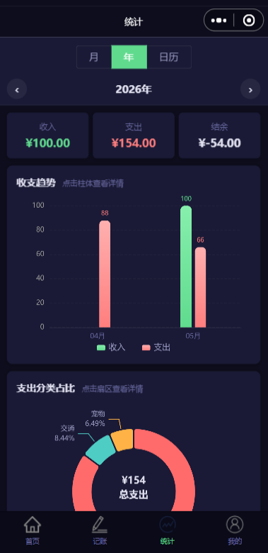

# 💰 花哪了

> 别等月底才问"花哪了"，每笔都记下来。

「花哪了」是一款基于**微信小程序**的个人记账工具，帮助你在日常开销发生时即时记录每一笔收入与支出。配合月/年统计图表和日历热力图，轻松掌控自己的财务状况。

---

## 📱 页面截图

### 启动页 & 登录

<div align="center">
  
  
</div>

### 首页（账单列表）

<div align="center">
  
  
</div>

首页顶部展示**月度汇总卡片**（本月结余、收入、支出），下方按日期分组展示账单流水。支持左右箭头切换月份、下拉刷新和上拉加载更多。长按记录可删除，点击记录可编辑。

### 记一笔（新增/编辑）

<div align="center">
  
  
</div>

支持切换**支出/收入**类型，从分类网格中选择类别，输入金额和备注，选择日期。编辑模式下会预填已有数据。

### 统计

<div align="center">
  
  
  
</div>

三种统计视图：
- **月视图** — 当月每日收支柱状图 + 支出分类饼图，点击图表可下钻查看明细
- **年视图** — 全年各月汇总柱状图 + 年度支出分类占比
- **日历视图** — 每日消费热度色块，点击某天查看当天账单

### 类别管理

<div align="center">
  
  
</div>

支持自定义支出/收入类别：新增、删除（默认类别不可删）、**拖拽排序**。可选择 emoji 图标或从相册上传自定义图片。

### 个人中心

<div align="center">
  
</div>

展示微信头像与昵称，提供类别管理入口、分享小程序。

---

## ✨ 功能特性

- 📝 **收支记录** — 记录每笔收入和支出，金额 + 分类 + 日期 + 备注
- 📊 **多维度统计** — ECharts 柱状图 / 饼图 / 日历热力图，按月、按年、按分类
- 🏷️ **自定义分类** — 支持新增、删除、拖拽排序，emoji 或自定义图标
- 🌙 **深邃暗黑主题** — 深蓝黑色调，全局 CSS 变量统一管理
- ☁️ **微信云开发** — 云函数 + 云数据库，无需自建后端
- 🔐 **微信头像昵称登录** — 使用微信最新头像昵称组件，无需授权弹窗
- 📤 **分享功能** — 支持微信原生分享

---

## 🛠 技术栈

| 类别 | 技术 |
|------|------|
| 前端框架 | 微信小程序原生 + ECharts (ec-canvas) |
| 样式方案 | WXSS + CSS 自定义属性（暗黑主题） |
| 后端服务 | 微信云开发（CloudBase） |
| 数据库 | 云数据库（NoSQL 文档型） |
| 云函数 | Node.js（登录 / 增删改查 / 统计） |
| 图表 | ECharts 5（柱状图、饼图、日历热力图） |

---

## 📁 项目结构

```
Expense-tracker/
├── app.js                        # 应用入口，云开发初始化
├── app.json                      # 页面路由、tabBar、全局组件注册
├── app.wxss                      # 全局样式
├── style/
│   └── variables.wxss            # CSS 变量（主题色、字号、间距）
├── utils/
│   ├── util.js                   # 日期格式化等工具函数
│   └── constants.js              # 默认分类、颜色、图标常量
├── images/                       # 底部 tab 图标 & 应用 logo
├── components/                   # 全局组件
│   ├── summary-card/             # 月度汇总卡片
│   ├── record-item/              # 单条账单记录
│   ├── category-grid/            # 分类选择网格
│   └── ec-canvas/                # ECharts 画布适配
├── pages/                        # 页面
│   ├── splash/                   # 启动页
│   ├── login/                    # 登录页
│   ├── index/                    # 首页（账单列表）
│   ├── add/                      # 记一笔（新增/编辑）
│   ├── stats/                    # 统计（月/年/日历）
│   ├── profile/                  # 个人中心
│   ├── categories/               # 类别管理
│   └── records/                  # 筛选记录列表
└── cloudfunctions/               # 云函数
    ├── login/                    # 用户登录
    ├── addRecord/                # 新增记录
    ├── getRecords/               # 查询记录（分页）
    ├── updateRecord/             # 更新记录
    ├── deleteRecord/             # 删除记录
    ├── getMonthlyStats/          # 月度统计
    ├── getYearlyStats/           # 年度统计
    ├── getCategories/            # 获取分类
    ├── addCategory/              # 新增分类
    ├── deleteCategory/           # 删除分类
    └── updateCategoryOrder/      # 更新分类排序
```

---

## 🚀 本地运行

### 前提条件

- [微信开发者工具](https://developers.weixin.qq.com/miniprogram/dev/devtools/download.html) 最新版
- 微信小程序 AppID（需注册[微信公众平台](https://mp.weixin.qq.com/)）
- 开通**微信云开发**（云数据库 + 云函数）

### 步骤

1. **克隆项目**

   ```bash
   git clone [<repo-url>](https://github.com/1104381746/spend-where.git)
   ```

2. **导入项目**

   打开微信开发者工具 → 导入项目 → 选择项目目录 → 填入 AppID

3. **开通云开发**

   在开发者工具中点击「云开发」→ 开通环境 → 创建以下云数据库集合：
   - `users` — 用户信息
   - `records` — 记账记录
   - `categories` — 支出/收入分类

4. **上传云函数**

   在开发者工具中，右键 `cloudfunctions/` 下的每个云函数 → 「上传并部署：云端安装依赖」

5. **运行**

   点击「编译」即可在模拟器中预览，或扫码在真机上体验。

---

## 📄 License

MIT

---

> 记账这件事，最难的不是操作，而是开始。从今天起，每一笔都记下来。
